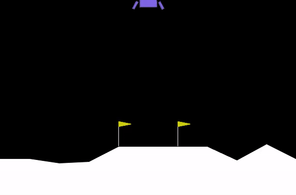

# Lunar Lander - Deep Q-Learning with PyTorch

This project demonstrates how to solve the [Lunar Lander](https://gymnasium.farama.org/environments/box2d/lunar_lander/#) environment from OpenAI Gymnasium using a Deep Q-Learning Network (DQN) implemented with PyTorch.

<p align='center'>
    
</p>

## Overview

The Lunar Lander environment involves controlling a spacecraft to land it safely on a designated landing pad. The agent receives rewards based on its landing success, with positive rewards for successful landings and negative rewards for crashes or moving away from the landing pad.

The DQN algorithm is a model-free reinforcement learning algorithm that uses a neural network to approximate the Q-values, which represent the expected cumulative reward of taking a particular action in a given state and following the optimal policy thereafter.

## Project Structure

- `train.py`: Script for training the DQN agent.
- `visualize.py`: Script for visualizing the trained agent's performance.
- `checkpoint.pth`: Saved model weights after training.
- `README.md`: Project documentation.

## Dependencies

- Python 3.7+
- NumPy
- PyTorch
- Gymnasium
- Imageio
- IPython

Install the dependencies using `pip`:

```bash
pip install numpy torch gymnasium imageio ipython
